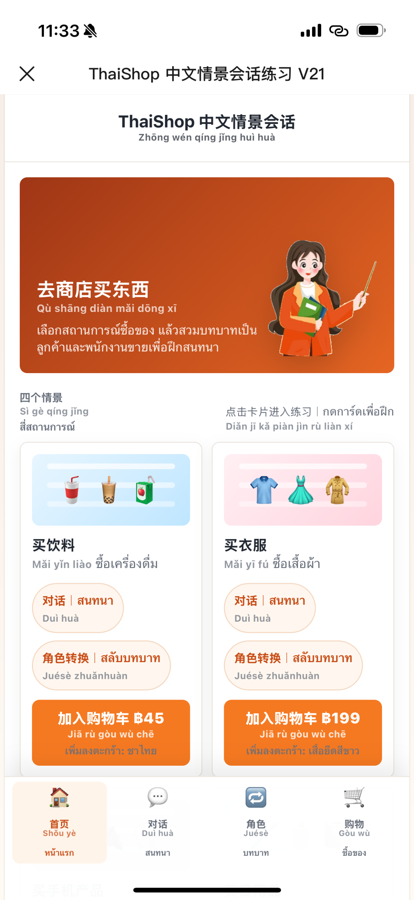
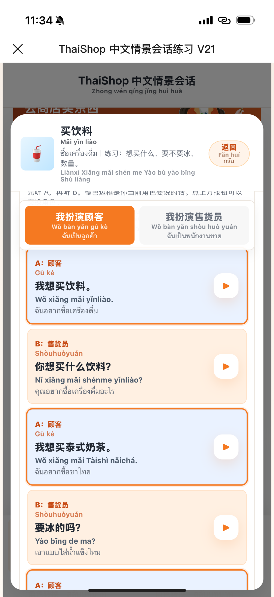
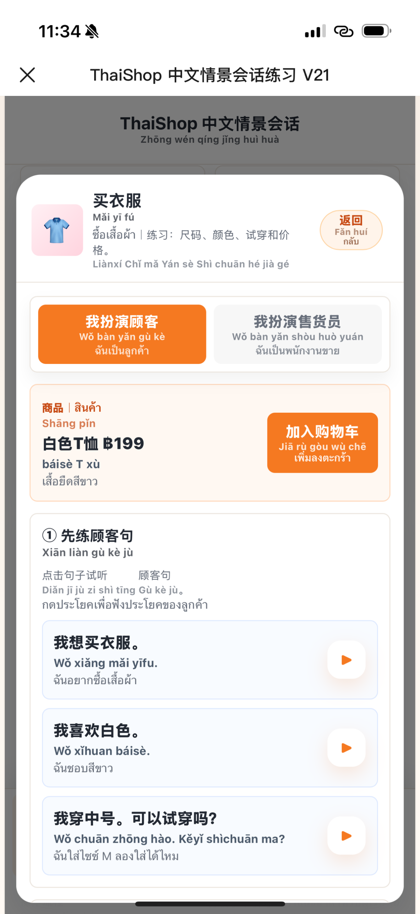
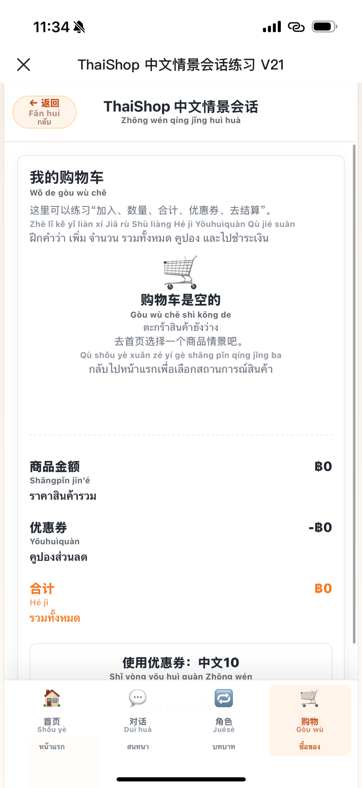
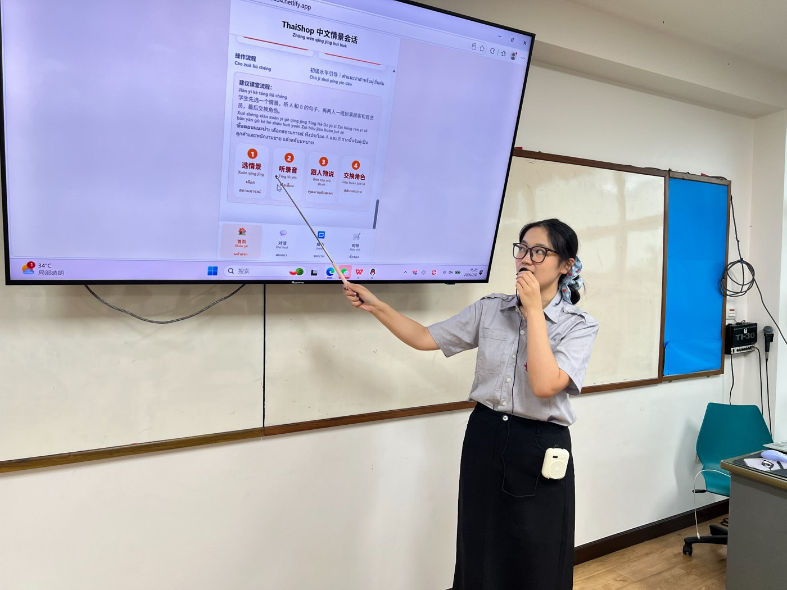
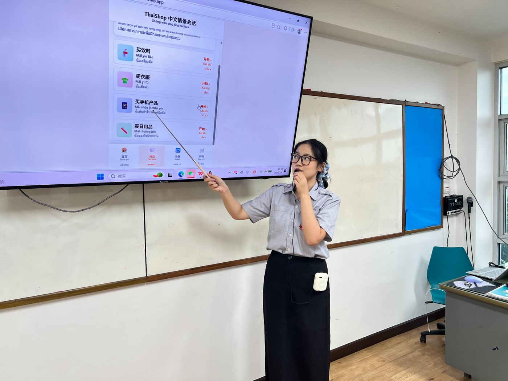
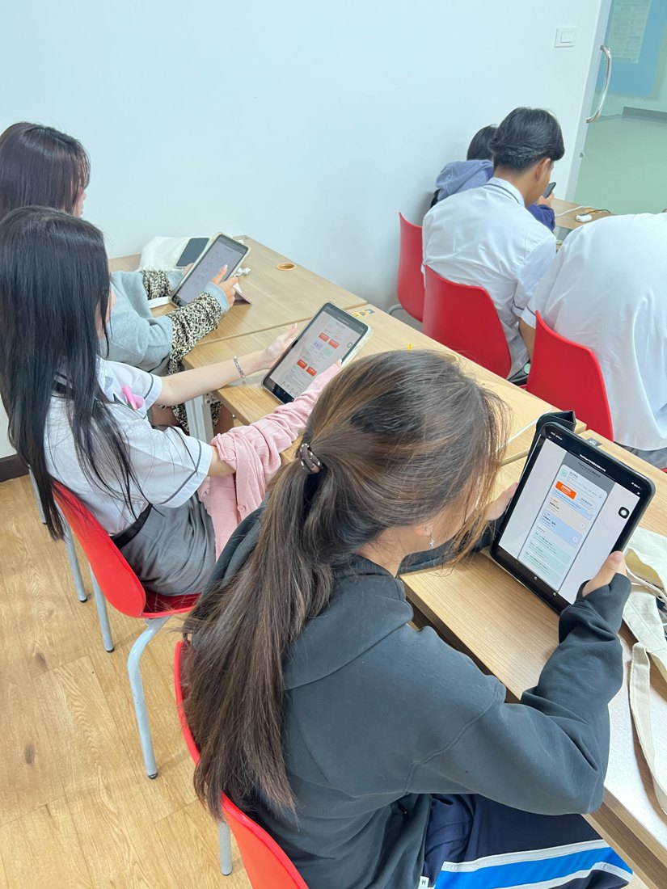
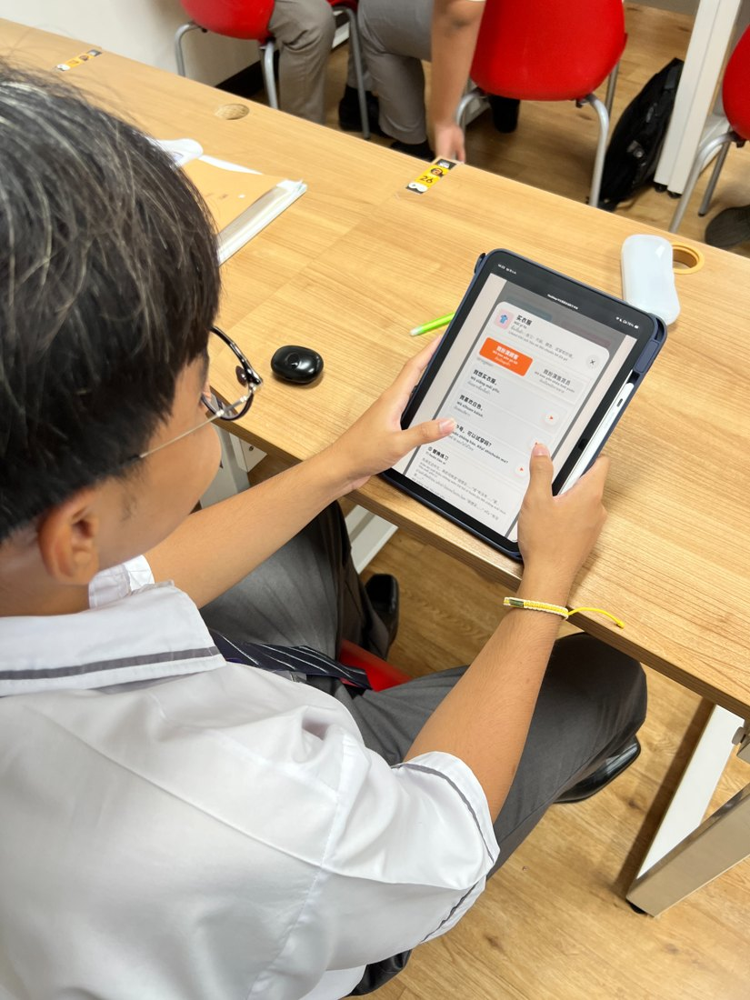
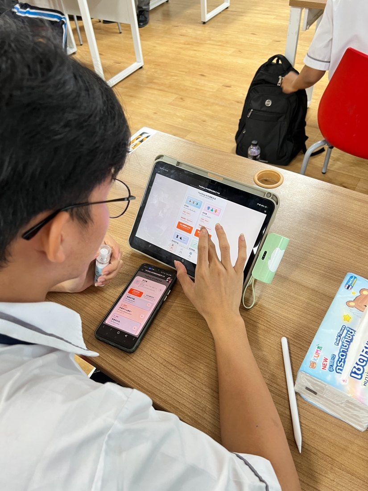
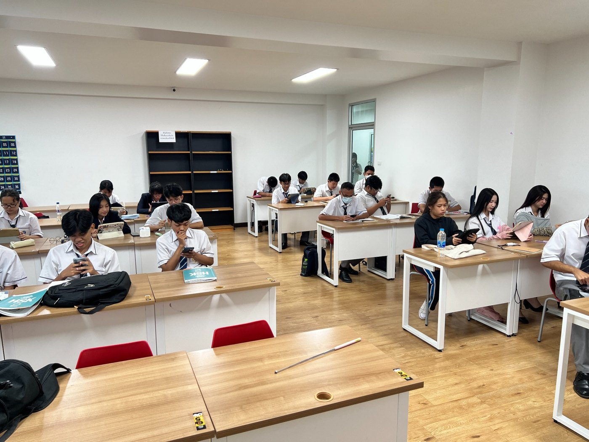

# ThaiShop 中文情景会话练习

## 一、项目简介

**ThaiShop 中文情景会话练习** 是一个面向泰国初级汉语学习者的网页互动练习项目。项目以“去商店买东西”为主题，把学生熟悉的网购和购物流程转化为中文学习任务，帮助学生在具体情境中练习购物词汇、句子和角色对话。

本项目服务于国际中文教育课堂，适合 HSK1—HSK2 入门阶段学生使用。网页围绕“买饮料、买衣服、买手机产品、买日用品”四个购物情景展开，并提供中文、拼音、泰文注释和本地中文音频。

<p align="center">
  
  
</p>

<p align="center">
  <em>图 1 网页首页与四个购物情景；图 2 买饮料情景中的 A/B 角色对话</em>
</p>

---

## 二、教学对象与使用场景

本项目适用于：

- 泰国初级汉语学习者；
- 零基础或初级水平学生；
- 15—18 岁青少年课堂；
- 购物、商品、价格、颜色、数量等主题教学；
- 国际中文教育案例展示、课堂实践与教学比赛材料。

项目核心目标不是让学生机械背诵句子，而是让学生在“选情景—听录音—跟人物说—角色转换—加入购物车”的流程中，逐步从“学过”走向“敢说”。

---

## 三、主要功能

### 1. 首页情景选择

学生可以从四个购物情景中选择一个进入练习：

- 买饮料
- 买衣服
- 买手机产品
- 买日用品

### 2. 中文、拼音、泰文三层支架

所有核心词句均提供：

- 中文原句；
- 汉语拼音；
- 泰文注释；
- 本地 MP3 音频。

这可以帮助初级学生降低理解和开口难度。

### 3. A/B 角色对话

网页中的对话采用 A/B 顺序展开，适合课堂两人一组练习：

- A：顾客
- B：售货员

学生可以先听 A，再听 B，然后进行角色扮演和角色交换。

### 4. 角色转换

学生可在“我扮演顾客”和“我扮演售货员”之间切换。橙色边框提示当前角色应该说的句子，降低学生不知道该说哪一句的压力。

### 5. 本地音频播放

每句中文都对应本地 MP3 文件，点击播放按钮即可听音并跟读。相比依赖浏览器 TTS，本地音频在安卓设备和课堂环境中更稳定。

### 6. 购物车模拟

学生可以把商品加入购物车，练习“加入购物车”“优惠券”“去结算”等购物表达。

<p align="center">
  
  
</p>

<p align="center">
  <em>图 3 买衣服情景练习；图 4 购物车与结算表达练习</em>
</p>

---

## 四、课堂建议流程

建议教师按照以下流程组织课堂：

| 阶段 | 教师活动 | 学生活动 |
|---|---|---|
| 1. 进入情景 | 教师展示首页，说明今天要“去商店买东西”。 | 学生选择饮料、衣服、手机产品或日用品情景。 |
| 2. 听录音 | 教师示范点击句子播放音频。 | 学生先听 A，再听 B。 |
| 3. 跟人物说 | 教师要求学生模仿录音跟读。 | 学生对着顾客或售货员角色重复句子。 |
| 4. 两人对话 | 教师安排一人顾客、一人售货员。 | 学生按照 A/B 顺序完成购物对话。 |
| 5. 交换角色 | 教师提醒学生换角色再练。 | 学生完成顾客与售货员角色转换。 |
| 6. 加入购物车 | 教师引导学生核对商品与价格。 | 学生练习加入购物车、优惠券和结算表达。 |

---

## 五、课堂实践照片

以下照片展示了网页在真实课堂中的使用方式，包括教师投屏讲解、学生使用平板或手机完成情景练习等。

<p align="center">
  
  
</p>

<p align="center">
  <em>图 5 教师利用大屏讲解网页操作流程；图 6 教师指导学生选择情景与听录音</em>
</p>

<p align="center">
  
  
</p>

<p align="center">
  <em>图 7 学生使用平板进行情景学习；图 8 学生在平板上点击句子并跟读</em>
</p>

<p align="center">
  
  
</p>

<p align="center">
  <em>图 9 学生使用手机与平板进行角色练习；图 10 全班学生在课堂中完成网页学习任务</em>
</p>

---

## 六、学习效果摘要

课堂数据表明，网页介入后学生的开口意愿、词句掌握、迁移作业和实景交际表现均有改善。

| 指标 | 学习前 | 学习后 | 变化 |
|---|---:|---:|---:|
| 课堂主动开口参与率 | 6/32，18.75% | 17/32，53.1% | +34.4 个百分点 |
| 角色扮演/情景互动完成 | 9/32，28.1% | 18/32，56.3% | +28.2 个百分点 |
| 购物词句测试平均分 | 41.2 分 | 65.3 分 | +24.1 分 |
| 测试达标率 | 约 4/32，12.5% | 22/32，68.8% | +56.3 个百分点 |
| 迁移作业合格/基本合格 | 4/32，12.5% | 14/32，43.8% | +31.3 个百分点 |
| 实景交际独立完成 | 0/10，0% | 4/10，40.0% | +40.0 个百分点 |

从结果看，ThaiShop 中文情景会话网页能够帮助学生把购物词句从“课堂跟读”转化为“情景中敢说”。同时，部分学生仍需要拼音、泰文或教师提示，说明该工具更适合作为入门阶段的低风险输出支架，而不是完全替代教师指导。

---

## 七、文件说明

如果使用单文件网页版本，GitHub 仓库中建议至少包含：

```text
index.html
README.md
docs/
└── images/
```

其中：

- `index.html`：网页主文件；
- `README.md`：项目说明文件；
- `docs/images/`：README 中使用的网页截图和课堂照片。

如果使用文件夹版本，也可能包含：

```text
audio/
assets/
```

其中：

- `audio/`：本地 MP3 音频；
- `assets/`：图片资源。

---

## 八、GitHub Pages 部署方法

### 第一步：上传文件

将以下内容上传到 GitHub 仓库：

```text
index.html
README.md
docs/images/
```

注意：网页主文件必须命名为：

```text
index.html
```

### 第二步：开启 GitHub Pages

进入仓库后：

1. 点击 **Settings**
2. 点击左侧 **Pages**
3. Source 选择 **Deploy from a branch**
4. Branch 选择 **main**
5. Folder 选择 **/root**
6. 点击 **Save**

等待 1—3 分钟后，GitHub Pages 会生成网站链接。

链接格式通常为：

```text
https://你的用户名.github.io/仓库名/
```

---

## 九、Netlify 部署方法

也可以直接使用 Netlify 部署：

1. 打开 Netlify；
2. 新建项目；
3. 上传包含 `index.html` 的文件夹；
4. 部署完成后复制网址；
5. 将网址或二维码发给学生使用。

---

## 十、使用注意事项

1. 本项目为教学模拟软件，不连接真实购物平台或真实支付系统。
2. 项目没有使用 Shopee、PromptPay 等真实平台的商标或官方页面。
3. 页面中的购物、结算、购物车均为课堂学习情境。
4. 建议教师在课堂使用前先测试网页链接、音频播放和投屏效果。
5. 如需保护学生隐私，发布公开仓库前可根据学校要求对课堂照片进行模糊处理或替换。

---

## 十一、教学价值

ThaiShop 中文情景会话练习的价值不在于技术复杂，而在于把学生熟悉的手机购物经验转化为可听、可读、可点、可说的中文学习任务。它为初级学习者提供了一个低风险、可重复、可模仿的语言输出环境，帮助学生逐步完成从“学过”到“敢说”的过渡。
